<!--
  ████  DEELI · github profile readme  ████
  Hand-coded "open artboard" banner + a small studio of widgets.
  Palette →  canvas #0d1117 · cream #e8e0d0 · vermilion #ec4d2b · petrol #0f8a7e
-->

---

### `/` now drawing…

I'm **Kamil**, known online as **Deeli** — an illustrator who codes. I live where **design meets the DOM**: building snappy interfaces with **React** & **Vue**, drawing **2D / vector** art, and modding **GTA&nbsp;V** with **C#** and **Lua** for fun. If something looks good *and* runs smooth, I probably had a hand in it.

> Currently shipping pixels at **[deeli.me](https://deeli.me/)** &nbsp;·&nbsp; sketching out loud on **[YouTube @Deeeli](https://youtube.com/@Deeeli)**

 

### `/` the palette — my toolbox

**Build the interface** &nbsp;

**Speak to the machine** &nbsp;

**Draw the rest** &nbsp;

 

### `/` contribution rhythm

 

### `/` a snake ate my contributions

 

### `/` find me in the wild

  

 

  <code>/</code> made with vectors, caffeine, and a stubborn eye for detail <code>/</code>

